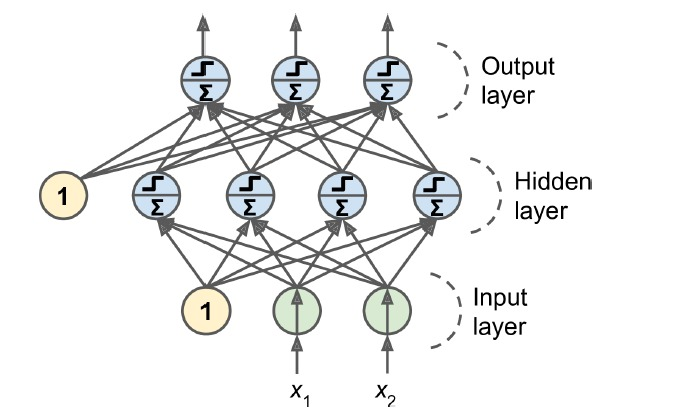
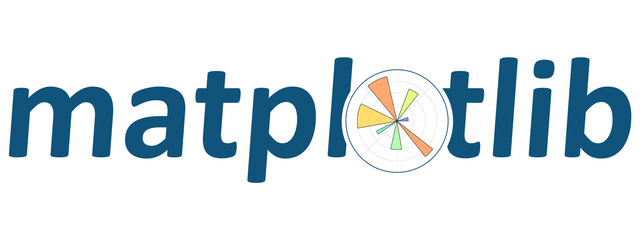

<h1 align = "center"> Spam Classifier </h1>

 

I have developed a spam classifier program in Python which classifies given emails as spam or ham using Multilayer Perceptron (MLP).

<h2> Overview</h2>

This Python program implements a spam classifier using a Multilayer Perceptron (MLP) model. The classifier is trained to classify emails as either spam or ham (non-spam) using the <a href="https://spamassassin.apache.org/old/publiccorpus/">Apache SpamAssassin public data</a>. The MLP model is chosen for its high efficacy in terms of precision and recall. The program is designed to be easily executable without any additional files or dependencies, as the required files will be automatically downloaded by the included Jupyter notebook.

<h2>Project Files</h2>

The project includes the following files:

<h4>Executable File:</h4>
<ul>
  <li><b>spam-classifier-optimized.ipynb</b> - A Jupyter Notebook containing all the necessary functions for training, testing, and classifying emails. This file includes all the required functions for performing classification operations.
  </li>
</ul>
<h4>Result Files:</h4>
<ul>
  <li><b>evaluation.txt</b> - Contains the evaluation results table, including the Confusion Matrix of the spam and ham classes.</li>
  <li><b>spam_classifier_best.sav</b> - Contains the weights of the most optimized model.</li>
  <li><b>confusion_matrix.png</b> - Visual representation of the Confusion Matrix for the final results.</li>
</ul>

<h2>Multilayer Perceptron (MLP)</h2>

The MLP is a type of Artificial Neural Network (ANN) architecture, originally invented by Frank Rosenblatt in 1957. It is based on an artificial neuron called a Threshold Logic Unit (TLU) or Linear Threshold Unit (LTU). In an MLP, the inputs and outputs are numerical values, and each input connection is associated with a weight. The TLU computes a weighted sum of its inputs, applies a step function to the sum, and outputs the result. The MLP consists of one input layer, one or more hidden layers of TLUs, and a final output layer of TLUs. Each layer, except the output layer, includes a bias neuron and is fully connected to the next layer.

 

<h2>Development Stages</h2>

The development of the spam classifier program follows the following stages, as outlined in the attached Jupyter Notebook:

<ol>
  <li>Download the dataset.</li>
  <li>Data preparation:
    <ul>
      <li>Remove email headers, including sender details, receiver details, subject, and date.</li>
      <li>Convert the entire email to lowercase.</li>
      <li>Replace all URLs in the email with the word 'URL'.</li>
      <li>Replace all numbers in the email with the word 'NUM'.</li>
      <li>Remove all punctuation marks from the email.</li>
    </ul>
  </li>
  <li>Split the dataset into training and test sets.</li>
  <li>Convert the text data into a bag-of-words representation, which is a vector of word counts for each training instance.</li>
  <li>Train and evaluate the MLP model based on recall, precision, and the Receiver Operating Characteristic (ROC) curve.</li>
  <li>Fine-tune the MLP classifier.</li>
  <li>Evaluate the classifier on the test set.</li>
</ol>

<h2> Technologies Used </h2>

 
  
  
  
  
  
  

<h2> Dependencies</h2>
<ul>
  <li> NumPy v1.16.2 </li>
  <li> Scikit-Learn v0.20.3 </li>
  <li> Matplotlib v3.0.2 </li>
  <li> Joblib v0.13.2 </li>
</ul>
